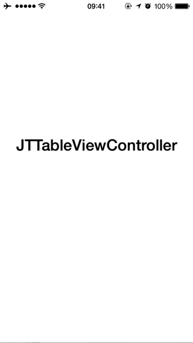

# JTTableViewController

[](https://travis-ci.org/jonathantribouharet/JTTableViewController)


A ViewController for manage pagination and loaders for iOS.

## Installation

With [CocoaPods](http://cocoapods.org/), add this line to your Podfile.

    pod 'JTTableViewController', '~> 1.0'

## Screenshots



## Usage

### Basic usage

```objective-c
#import <UIKit/UIKit.h>

#import <JTTableViewController.h>

@interface ViewController : JTTableViewController

@end
```

```objective-c
#import "ViewController.h"

@implementation ViewController

// If you don't implement this method, UITableViewAutomaticDimension will return by default
- (CGFloat)tableView:(UITableView *)tableView heightForRowAtIndexPath:(NSIndexPath *)indexPath
{
    // Automatically return the height of nextPageLoaderCell, by default use UITableViewAutomaticDimension
    JTTABLEVIEW_heightForRowAtIndexPath
    
    return 44.;
}

// Must be implemented
- (UITableViewCell *)tableView:(UITableView *)tableView cellForRowAtIndexPath:(NSIndexPath *)indexPath
{
    // Automatically return nextPageLoaderCell and call startFetchingNextResults if needed
    JTTABLEVIEW_cellForRowAtIndexPath
    
    UITableViewCell *cell = [tableView dequeueReusableCellWithIdentifier:@"Cell" forIndexPath:indexPath];
    
    // Do whatever you want to use the data
    cell.textLabel.text = self.results[indexPath.row];
    
    return cell;
}

// Must be implemented
- (void)startFetchingResults
{
    [super startFetchingResults];
    
    [service retrieveDataWithOffset:0 success:^(NSArray *results, BOOL haveMoreData) {
        [self didFetchResults:results haveMoreData:haveMoreData];
    } failure:^{
        [self didFailedToFetchResults];
    }];
}

// Must be implemented
- (void)startFetchingNextResults
{
    [super startFetchingNextResults];
    
    [service retrieveDataWithOffset:self.results.count success:^(NSArray *results, BOOL haveMoreData) {
        [self didFetchNextResults:results haveMoreData:haveMoreData];
    } failure:^{
        [self didFailedToFetchResults];
    }];
}

@end
```

You have to bind the `tableView` with the controller, automatically it will set the delegate and the dataSource.

You have to implement `startFetchingResults` and `startFetchingNextResults` methods. They are used to load data (from your web service for example). These methods must call `super`.

`startFetchingResults` is used to retrieve new data (erase all previous data) whereas `startFetchingNextResults` is used for get more data (the pagination).

`didFetchResults:haveMoreData:` must be call when `startFetchingResults` have successfuly retrieve data.

`didFetchNextResults:haveMoreData:` must be call when `startFetchingNextResults` have successfuly retrieve data.

`didFailedToFetchResults` must be call if `startFetchingResults` or `startFetchingNextResults` have failed to retrieve data.

The data are stored in `results`. Just use `self.results` to access to them.

There are some properties you can customize:
- `nextPageLoaderCell` is the loader use for the pagination, it's a `UITableViewCell`
- `noResultsView` is the view display when the results get from your webservice are empty
- `noResultsLoadingView` is the view display when there is no results and you start fetching new data, used for the first load
- `nextPageLoaderOffset` is the number of cells require before the last cell for calling `startFetchingNextResults`, by default it's 3

You can also override some methods:
- `showNoResultsView`
- `hideNoResultsView`
- `showNoResultsLoadingView`
- `hideNoResultsLoadingView`
- `endRefreshing`

## Requirements

- iOS 7 or higher
- Automatic Reference Counting (ARC)

## Author

- [Jonathan Tribouharet](https://github.com/jonathantribouharet) ([@johntribouharet](https://twitter.com/johntribouharet))

## License

JTTableViewController is released under the MIT license. See the LICENSE file for more info.
